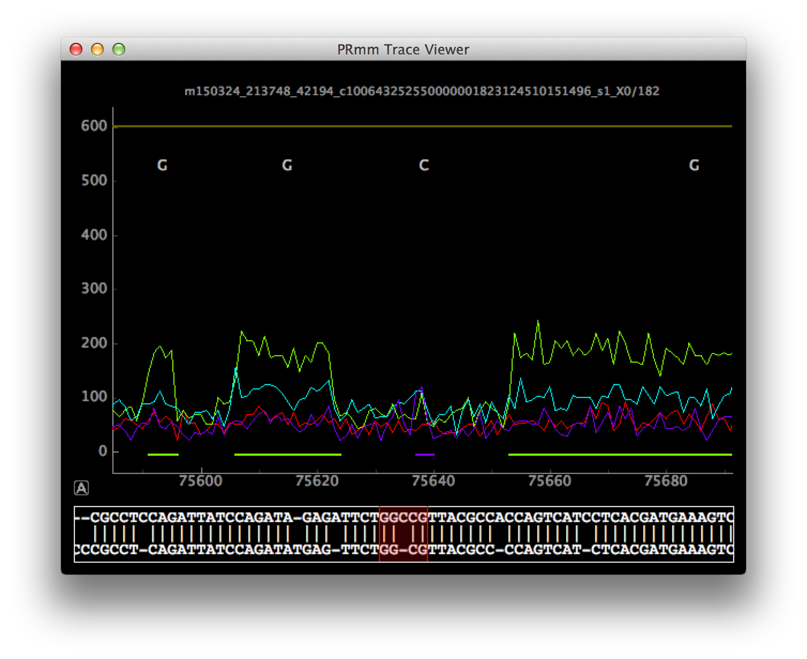

PRmm (PulseRecognizer minus minus; pronounced *perm*), is a basic
interactive PacBio trace viewer.  It is portable and simple.

Additionally, the backend ("model") of PRmm is designed to be usable
for data analysis from the perspective of a ZMW---providing simple
access to the collated trace, pulsecall, basecall, and alignment data
resulting from the ZMW.
